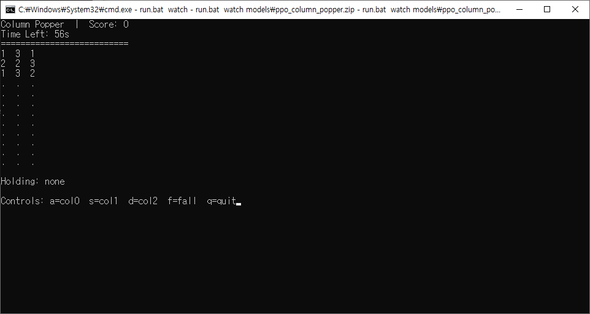

# Column Popper




Column Popper is a terminal-playable number puzzle that also functions as a Gymnasium-compatible reinforcement learning environment. Numbers fall into three columns on a schedule; you pick up from a column and drop into another to make vertical triples that pop for points. The game ends on overflow or when time runs out. The environment is deterministic when seeded.

- Env ID: `SpecKitAI/ColumnPopper-v1`
- Board: `12 x 3` (int32, `0` = empty, values from `[1,2,3]`)
- Actions: `Discrete(4)` → `0,1,2` select/drop on target column; `3` manual fall
- Observation: `Dict(board:int32[12,3], selection:int32[2], sel_pos:int32[2], optional time_left_norm:float32[1])`

## Quick Install

```bash
# optional: create venv first
python -m venv .venv
source .venv/bin/activate   # Windows: .venv\Scripts\Activate.ps1

pip install -e .[dev]
# Windows only (for curses UI)
pip install windows-curses
```

If the `column_popper` command isn’t found, try: `python -m column_popper.cli.play --mode=play`.

## Quick Play (Terminal UI)

```bash
# Windows batch helper
run.bat play

# Direct CLI
column_popper --mode=play --seed=42

# Options
#   --ui=curses|ansi
#   --initial-fall <seconds> (default 3.0)
#   --fall-curve "t:interval,..." (default "20:2,40:1")
```

Controls: `a` = column 0, `s` = column 1, `d` = column 2, `f` = manual fall, `q` = quit.

## Quick Demo (Gym)

```bash
# Windows
run.bat demo

# Cross‑platform
python scripts/gym_demo.py
```

## Headless Rollout (JSONL)

Provide actions on stdin (0–3), receive JSONL frames on stdout.

```bash
python - << 'PY'
import random
for _ in range(200):
    print(random.choice([0,1,2,3]))
PY
\
| column_popper --mode=rollout --episodes=5 --format=jsonl --seed=42
```

Each line includes: `episode`, `step`, `action`, `reward`, `terminated`, `truncated`, `info`, and `obs`.

## Streaming Protocol (Interactive JSONL)

```bash
column_popper --mode=stream --episodes=1 --seed=42
```

Sends `meta`, `reset`, `step_request` messages and expects one integer action per line. Emits `step_result` and `done`.

## Gym Usage (Programmatic)

```python
import gymnasium as gym
import column_popper.envs  # Ensure env registration

env = gym.make("SpecKitAI/ColumnPopper-v1", seed=42)
obs, info = env.reset()
for _ in range(1000):
    action = env.action_space.sample()
    obs, reward, terminated, truncated, info = env.step(action)
    if terminated or truncated:
        obs, info = env.reset()
env.close()
```

## Quick Train and Watch (Stable‑Baselines3 PPO)

```bash
# Install SB3 (and its deps)
pip install stable-baselines3[extra]

# Train
#   Windows helper (defaults to 300000 timesteps if omitted):
run.bat train 500000 --epsilon-fall 0.05

#   Cross‑platform:
python scripts/train_agent.py --timesteps 500000 --epsilon-fall 0.05

# Watch the trained model in curses UI
#   Windows:
run.bat watch models\ppo_column_popper.zip

#   Cross‑platform:
python scripts/watch_agent_curses.py --model models/ppo_column_popper.zip
```

## Development

```bash
# Lint and type-check
ruff check .
mypy .

# Run tests
pytest -q
```

Project structure is defined in `specs/001-build-a-terminal/plan.md` and progress in `specs/001-build-a-terminal/tasks.md`.
